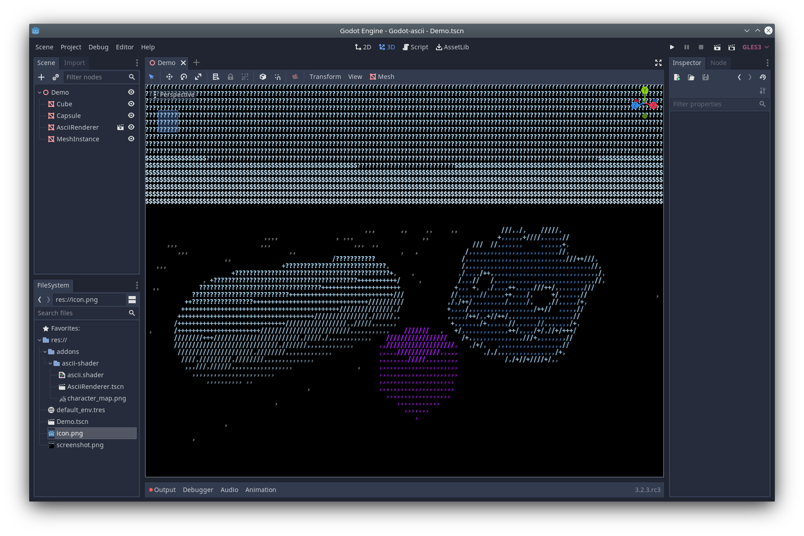

# godot-ascii-shader

A simple ASCII shader for Godot. Renders whatever the camera would render, but as ASCII art. Works in-game and in-editor.

Inspired by https://github.com/StefanJo3107/ASCII-Rendering-Shader-in-Unity.

## Usage

Just add the AsciiRenderer node to the scene which should be rendered that way, and you're done! The character size can be changed in the shader parameters.

## Explanation

The coordinates are clamped to a grid (which will become the ASCII characters). The greyscale color value (the brightness) at these coordinates is used to decide whether a mostly empty character like `.` or a mostly full character like `#` should be used. The coordinates within the current grid cell serve as the UV coordinates in a texture containing ASCII characters, along with the offset from the previous step.
